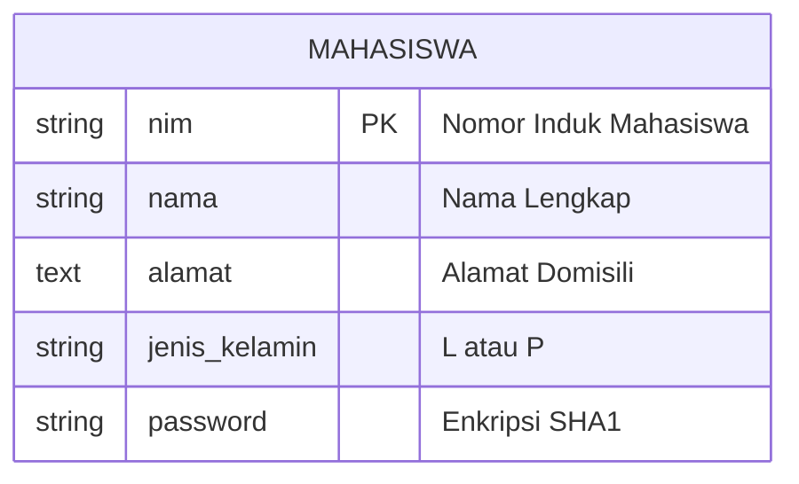
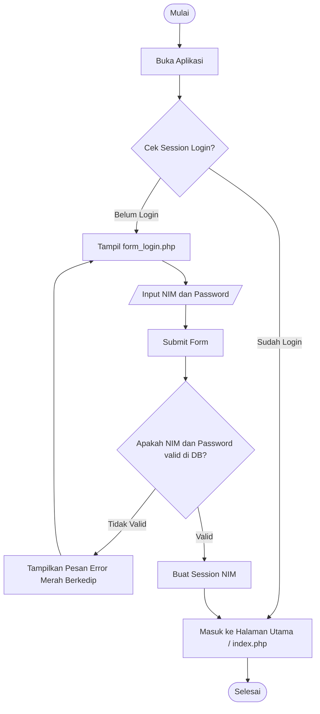
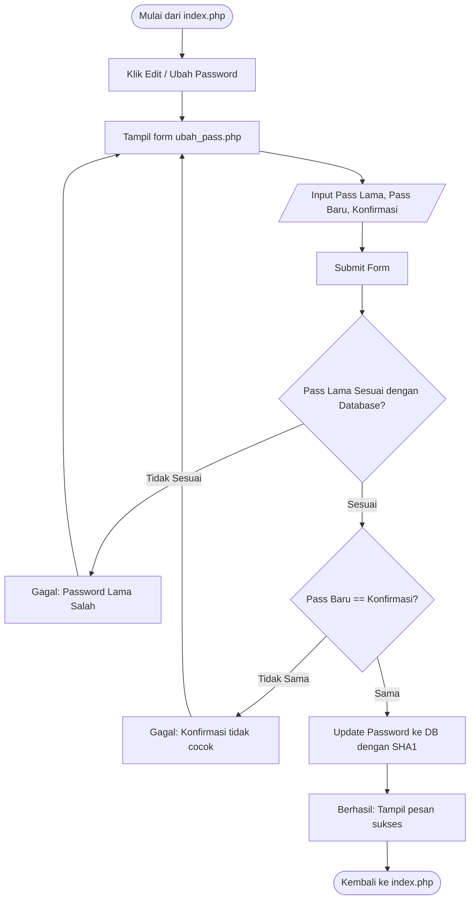

# ERD, DFD, dan Flowchart

Berikut adalah diagram alur (Flowchart) dan diagram sistem yang mungkin kamu butuhkan jika ditanya asesor. Diagram ini digenerate menggunakan sintaks Mermaid. Kamu dapat menggunakan ekstensi VSCode seperti "Markdown Preview Mermaid Support" atau website seperti `mermaid.live` untuk melihat gambarnya.

## 1. Entity Relationship Diagram (ERD)
Sesuai soal, hanya ada satu tabel.

## 2. Flowchart Login System

## 3. Flowchart Ubah Password

